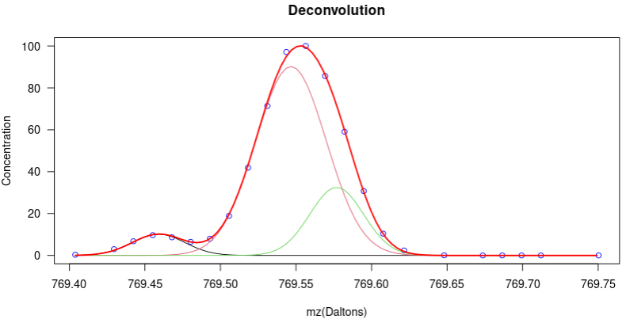

>rSirem is an R package useful for deconvolution of overlapping peaks in mass spectrometry (MS). From a range of masses belonging to a data set in imzML format, it generates a set of centroids (peak-picking). The algorithm does not require any type of prior processing although it tolerates any type of intervention.



## Installation

> devtools::install_github("EdelCastillo/rSirem")

> Please note that is a development version and no release has been made yet. So, keep looking at this page for future updates and releases.

> **NOTE**: This package has dependencies on another:

> devtools::install_github("prafols/rMSI2")

>It uses this second package to manage the imzML files.

## Use guide

### **Step 1**.- It consists of providing the file that contains the data set..

> myData \<- rMSI2::LoadMsiData("absolute_path_file_name.imzML");

### **Step 2**.- A list is generated with the test parameters.

> For **example**:  
> params\<-list("algorithm"=0, "minMeanPxMag"=1, "minSectionDensity"=5, "noiseLevel"=1, "tileSide"=4, "referenceType"=1, "cutLevels"=50, "siremSensitivity"=c(0.0001, 0.05), "magSensitivity"=c(0.01, 1), "normalization"=0);

**Description of the parameters:**

```         
algorithm         : 0 = sirem; 1=entropy.
minMeanPxMag      : absolute minimum averaged concentration value to be considered.
minSectionDensity : minimum active pixel density value in the image to be considered (%).
noiseLevel        : absolute noise Level[0:maxConcentration]: lower values are considered null.
tileSide          : number of side pixels of the square tile: 1(1x1), 2(2x2), 3(3x3), 4(4x4)
referenceType     : reference image type:
                     0=obtained from concentration info (data).
                     1=the image with the highest average value is adopted.
                     2=all pixels have significant concentration.
cutLevel          : cut level to apply to each image to generate binary images (percentile).
siremSensitivity  : variable sensitivity depending on the sirem level[0:1] (bounded between limits).
magSensitivity    : variable sensitivity depending on the concentration level[0:maxConcentration] (bounded between limits).
normalization     : 0=none
                  : 1=TIC
                  : 2=RMS
                  : 3=MAX
```

### **Step 3**.- The Sirem algorithm is applied and its peaks are obtained:

> rGetSiremPeaks\<-function(rMSIData, params, initMass, finalMass)

**Description of the parameters:**   
```
   rMSIData: sample data obtained from the file with rMSI2::LoadMsiData().
     params: parameters given in the previous step.
   initMass: initial mz of the block to be deconvolved (Da).
  finalMass: final mz of the block to be deconvolved (Da).
  
  return a list: 
    siremPeaks -> sirem and peak information; 
    massAxis   -> mass axis corresponding to the images.
```

For **example:**  
> siremPeaks<-rGetSiremPeaks(myData, params, 769.4, 769.75);


### **Step 4**.- The Gaussians that decompose the peaks are obtained.

> rGetGaussians\<-function(rMSIData, siremInfo, pixel, minMeanValue)

**Description of the parameters:**
```
    rMSIData: sample data obtained from the file with rMSI2::LoadMsiData().
   siremInfo: sirem data and peaks obtained from rGetSiremPeaks().
       pixel: pixel whose spectrum is deconvolved. if pixel\<=0, averaged data is used
minMeanValue: minimum averaged value of a peak to consider it valid.

return  list: 
   gaussians: matrix with the parameters of the Gaussians.
       xAxis: X axis (Daltons) (if error xAxis=0)
       yAxis: Y axis (concentration) (if error yAxis=0)  
```

> For **example:**   
> gaussInfo\<-rGetGaussians(myData, siremPeaks, 0, 1);

### **Step 5**.- The results are displayed. This is an optional step.

> rPlotDeconv\<-function(gaussInfo)

**Description of the parameters:**   
> gaussInfo -\> information returned by rGetGaussians().

>For **example**:  
> rPlotDeconv(gaussInfo)

>For [complementary information](./cmpInfo.md) about another functions.
